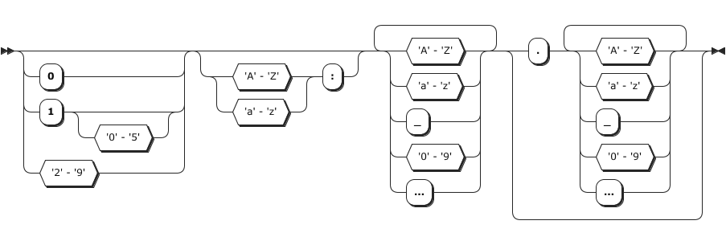
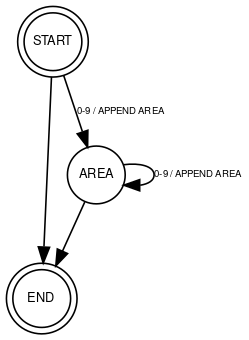
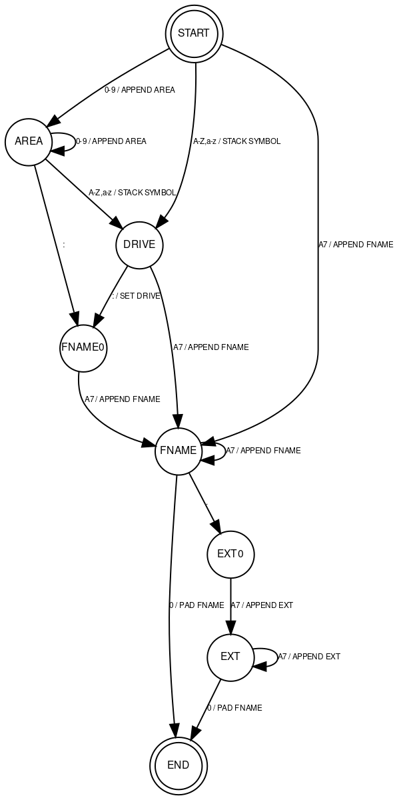

# Z80 MasterClass: Finite State Machines

[oddbit-retro, 11.2.2023](https://www.oddbit-retro.org/z80-masterclass-the-automata/)

Hi there! If you're into *Z80*, finite state machines, or *CP/M*, you've come to the right place. In this example of a not-so-simple *Z80* finite state machine, we're showcasing the implementation of an *CP/M* path parser.

In this demonstration, we'll be parsing a *CP/M* path that includes the  drive, the user area, the name, and its extension. As an example, consider `2A:TEST.DAT`.

While using an *FSM* for this particular task may not be the most efficient approach, our goal is to demonstrate the technique. After that, you can apply it to more complex projects, such as the standard *C* `printf` function or a tokenizer for a programming language.

## The CP/M Path Syntax and Semantics

Here's the syntax diagram for our parser.

There are two additional semantic rules that a valid path must follow:

  1. Both the name and extension must be 7-bit ASCII strings and can't include any of the following characters: < > . , ; : = ? * [ ] % | ( ) / .

  2. The maximum length allowed for the name is 8 characters, and for the extension, it's 3 characters.

## Introducing the Finite-State Machine

We're tackle the parsing task using a [Mealy machine](https://en.wikipedia.org/wiki/Mealy_machine). Our input will be **the current state** and **a character**, and our output will be **a call to a function that handles that character**, and **the next state**.

Let's create a partial FSM for parsing the area at the beginning of the path:

To encode this FSM we could create an adjacent matrix for state transitions, but that would consume a lot of memory. Instead, let's create a simple table of transitions. Each transition will be a row of data: `<start state>, <condition>, <function to call>, <next state>`. 

We can describe our partial FSM like this:

`START, 0-9, APPEND AREA, AREA`
`START, , , END`
`AREA, 0-9, APPEND AREA, AREA`
`AREA, , , END`

The first row tells us that if we are in the `START` state and the next character falls within the range of `0` to `9`, we will execute the `APPEND AREA` function and then transition to the `AREA` state. 

The second row is a little different as it has no test or function defined. For this case, we've established that **a missing condition always evaluates to true** and **a missing function means no code will be executed**. Last but not least: **the finite-state machine will follow the rules in the order they are specified**.

### Encoding the Finite-State Machine

We can tweak the way we encode our finite-state machine, depending on the number of states, conditions, and functions. Take this partial FSM for example. 

It's got three states: `START`, `AREA`, and `END`. And all it takes to represent them is just 2 bits.

| state | bits |
|-------|:----:|
| START | 00   |
| AREA  | 01   |
| END   | 10   |

The two conditions: `0-9`, and `the empty condition` only require 1 bit. 

| cond  | bit  |
|-------|:----:|
| empty |   0  |
| 0-9   |   1  |

And the two functions: the `APPEND AREA`, and `an empty function`, also require 1 bit. 

| function    | bit  |
|-------------|:----:|
| empty       |   0  |
| APPEND AREA |   1  |

Hence, each full transition's description takes up 6 bits, with 2 bits representing the initial state, 1 bit for the condition, another 1 bit for the function, and the final 2 bits indicating the state to transition to. All in all, the whole FSM utilizes 24 bits, which is equivalent to 3 bytes. It's a compact representation, good enough for the job.

## The Complete Finite-State Machine

We got everything figured out. Now it's time to build the real finite-state machine we're gonna use for the task. 

### Encoding

The machine has eight states and we can represent them using just 3 bits. We got less than eight functions, which'll take up an additional 3 bits. And we got six conditions, which'll need 3 bits too. This means we can fit each transition into 2 bytes, or all 15 state transitions into 30 bytes. Here's the actual FSM definition in Z80 assembly language.

~~~asm
        ;; automata states
        .equ    S_START,        0b00000000
        .equ    S_AREA,         0b00000001
        .equ    S_DRIVE,        0b00000010
        .equ    S_FNAME0,       0b00000011
        .equ    S_FNAME,        0b00000100
        .equ    S_EXT0,         0b00000101
        .equ    S_EXT,          0b00000110
        .equ    S_END,          0b00000111

        ;; automata test
        .equ    T_ELSE,         0b00000000
        .equ    T_DIGIT,        0b00010000
        .equ    T_COLON,        0b00100000
        .equ    T_DOT,          0b00110000
        .equ    T_ALPHA,        0b01000000
        .equ    T_ASCII7,       0b01010000
        .equ    T_ZERO,         0b01100000

        ;; automata functions
        .equ    F_NONE,         0b00000000
        .equ    F_APPEND_AREA,  0b00010000
        .equ    F_STACK_SYM,    0b00100000
        .equ    F_SET_DRV,      0b00110000
        .equ    F_APPEND_FNAME, 0b01000000
        .equ    F_APPEND_EXT,   0b01010000

        ;; ----- automata definition ------------------------------------------
        ;; each transition is 2 bytes
        ;; byte 0:
        ;;  TTTTSSSS    T=test, S=start
        ;; byte 1:
        ;;  FFFFEEEE    F=function, E=end
        ;; example:
        ;;  00010000, 00000001 (start=0, test=1, function=0, end=1)
fpa_automata:
        .db     S_START + T_DIGIT,      S_AREA + F_APPEND_AREA
        .db     S_START + T_ALPHA,      S_DRIVE + F_STACK_SYM
        .db     S_START + T_ASCII7,     S_FNAME + F_APPEND_FNAME
        .db     S_AREA + T_DIGIT,       S_AREA + F_APPEND_AREA
        .db     S_AREA + T_COLON,       S_FNAME0 + F_NONE
        .db     S_AREA + T_ASCII7,      S_DRIVE + F_STACK_SYM
        .db     S_DRIVE + T_COLON,      S_FNAME0 + F_SET_DRV
        .db     S_DRIVE + T_ASCII7,     S_FNAME + F_APPEND_FNAME
        .db     S_FNAME0 + T_ASCII7,    S_FNAME + F_APPEND_FNAME
        .db     S_FNAME + T_ASCII7,     S_FNAME + F_APPEND_FNAME
        .db     S_FNAME + T_ZERO,       S_END + F_NONE
        .db     S_FNAME + T_DOT,        S_EXT0 + F_NONE
        .db     S_EXT0 + T_ASCII7,      S_EXT + F_APPEND_EXT
        .db     S_EXT + T_ASCII7,       S_EXT + F_APPEND_EXT
        .db     S_EXT + T_ZERO,         S_END + F_NONE
efpa_automata:
~~~

### The Implementation

Our target is to write following parse function. We will pass it the path and it will parse it and populate our `fcb` structure and the user `area`. 

~~~C
extern uint8_t fparse(char *path, fcb_t *fcb, uint8_t *area);
~~~

The CP/M `fcb_t` type is defined as 

~~~C
typedef struct fcb_s {
    uint8_t drive;          /* 0 -> Searches in default disk drive */ 
    char filename[8];       /* file name ('?' means any char) */
    char filetype[3];       /* file type */
    uint8_t exn;            /* CP/M extent */
    uint16_t resv;          /* reserved for CP/M */
    uint8_t rc;             /* records used in extent */ 
    uint8_t alb[16];        /* allocation blocks used */
    uint8_t seqreq;         /* sequential records to read/write */
    uint16_t rrec;          /* rand record to read/write */ 
    uint8_t rrecob;         /* rand record overflow byte (MS) */
} fcb_t; /* file control block */
~~~

We will only populate the first three members of this structure: `drive`, `filename`, and `filetype`. The `filename` and `filetype` members must be padded with spaces if shorter than the allocated space.

The SDCC compiler will place function arguments on the stack from last to first. The last value on the stack will be the return address. Here's the code that pops the function arguments up and initializes the `fcb_t` structure.

~~~asm
_fparse::
        ;; fetch args from stack
        pop     af                      ; ignore the return address...
        pop     hl                      ; pointer to path to hl
        exx
        ;; pad filename and extension (of FCB) with spaces
        pop     de                      ; pointer to fcb to de
        push    de                      ; return it
        xor     a                       ; a=0
        ld      (de),a                  ; default drive
        inc     de                      ; skip over default 
        ld      b,#11                   ; 8+3 filename
        ld      a,#' '                  ; pad with spaces
fpa_init_fcb:
        ld      (de),a
        inc     de
        djnz    fpa_init_fcb
        pop     de                      ; restore de
        pop     bc                      ; pointer to area to bc
        exx
        ;; restore stack and make iy point to it
        ld      iy,#-8
        add     iy,sp
        ld      sp,iy
~~~

The arguments for the function will not be needed once they're moved to the registers, so why not put that 8 bytes of space to good use and store some FSM local variables there? This is what the code's gonna keep in that space:

~~~asm
        ;; we will use space from 2(iy) to 7(iy) as
        ;; local variables ... overwriting function arguments
        ld      2(iy),#S_START          ; initial state to 2(iy)!
        ld      3(iy),#R_UNEXPECT       ; status is unexpected
        ld      4(iy),#DEFAULT_AREA     ; default area
        ld      5(iy),#NO_SYM           ; stacked symbol
        ld      6(iy),#0                ; fname len
        ld      7(iy),#0                ; ext len
~~~

Now let's write the main parser routine. Recall that the address of the path  is stored in the `HL` register.

~~~asm
fpa_nextsym:
        ;; fetch next symbol / character
        ld      a,(hl)
        push    hl                      ; store hl!
        ;; find the matching transition in the transition table
        call    fpa_find_transition
        ;; if not found then unexpected error
        jr      nz,fpa_done
        ;; else transition function id is in register l, call it!
        call    fpa_execfn
        jr      nz,fpa_done             ; if not zero then status!
        ;; is it final state?
        ld      a,2(iy)
        and     #0x0f
        cp      #S_END
        jr      z,fpa_done
        ;; loop
        pop     hl                      ; restore hl
        inc     hl                      ; next symbol
        jr      fpa_nextsym             ; and loop
~~~

This routine's got a simple job, it grabs a symbol (a character) from the filename. Then, using both the symbol and the current state, it calls the `fpa_find_transition` function to find the right transition. If it can't find it, it throws an error. But if it does, it calls the function and moves on to the next transition. And before grabbing the next symbol, it takes a quick check to see if it's reached the final state.

We locate the transition by looping through the entire finite-state machine and searching for the right one.

~~~asm
        ;; find transition
fpa_find_transition:
        ld      hl,#fpa_automata        ; address of mealy automata
        ;; b=total transitions
        ld      b,#((efpa_automata-fpa_automata)/2)
        ld      c,a                     ; store a
fpaft_loop:
        ld      a,(hl)                  ; get first byte
        and     #0b00001111             ; get state
        cp      2(iy)                   ; is it current state?
        call    z,fpaft_test            ; call test
        jr      nz,fpaft_next           ; test failed, next trans.
        inc     hl                      ; get next byte
        ld      a,(hl)                  ; get second byte to a
        and     #0b00001111             ; grab next state
        ld      2(iy),a                 ; store to current state
        ld      a,(hl)                  ; get second byte to a
        and     #0b11110000             ; extract function
        ld      l,a                     ; get function to l
        ;; and return success
        xor     a
        ld      a,c
        ret
fpaft_next:
        inc     hl                      ; next state
        inc     hl
        djnz    fpaft_loop              ; and loop it
        ;; if we are here, we did not find
        ;; the transition. clear zero flag!
fpaft_unexpect_sym:
        ld      3(iy), #R_UNEXPECT
fpaft_set_z:
        xor     a
        cp      #0xff                   ; rest z flag
        ld      a,c                     ; resotre a
        ret
~~~

The `fpaft_test` function goes through the conditions specified in the transition and sets the `Z` flag if everything checks out.

And to wrap things up, the logic for filling in the fcb_t and return arguments is tucked away in the FSM functions. Here's an example of the `SET DRIVE` function, just to give you an idea.

~~~asm
        ;; set drive
fpafn_set_drv:
        ld      a,5(iy)                 ; get stacked symbol
        ld      5(iy),#0                ; empty stack
        exx
        ld      (de),a                  ; first byte of FCB 
        exx
        xor     a
        ret
~~~

[Click here to see the complete source code](https://github.com/tstih/idp-udev/blob/main/src/ulibc/fparse.s) of the parser finite state machine, described in this article.