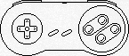
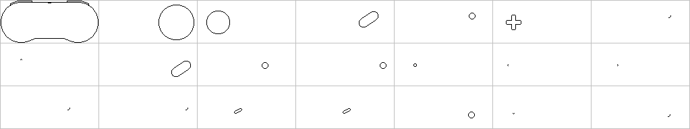

# Iskra Delta Partner Graphics Programming, Part 1: Embracing the Art of Line Drawing

[oddbit-retro, 1.6.2023](https://oddbit-retro.org)

# Introduction
In today's world of high-resolution graphics and advanced GPUs, it's easy to forget the humble beginnings of computer graphics. One such piece of history is the *Iskra Delta Partner*, a 40-year-old computer with a *Thomson EF9367* Graphical Display Processor (GDP) that can only draw lines. The constraints of this system make programming for it an exotic and intriguing challenge, as there is no raster support. It's almost like working with a vector display, where everything must be drawn using lines only.

 >The EF9367 chip supports raster operations and text. However, in the Iskra Delta Partner, raster functionality is disabled. Furthermore, the chip is limited to a single 5x7 font, which it renders internally using lines alone. This approach lacks clipping capabilities, rendering it unsuitable for windowing graphical user interfaces.

 

 In this series we will develop a 2D graphics library and support tools for the Iskra Delta Partner. 

Our initial task for the Part 1 of the series is to develop a tool that, when provided with a 1-bit per pixel bitmap, converts it into lines, essentially vectorizing the image. 

# Prerequisites
To fully grasp the concepts presented, you should have a basic understanding of the graph theory and know C++, *CMake* and *git*.

We will develop on Linux using modern C++ and the CMake build system. Therefore, you will need the latest version of either g++ or clang, with support for the C++20 standard.

We will use [Patrick Boettcher's header only command line argument parser library](https://github.com/pboettch/cxx_argp).

The *Standard C++ library* lacks images processing capabilities, so we will use [Sean Barrett's header-only libraries](https://github.com/nothings/stb) to address this limitation. These libraries enables us to read a PNG file and convert it into a raw RGB array, which can then be traversed and processed as needed.

 > Our objective is to examine algorithms more closely, which will involve some raw programming. For professional development, using *OpenCV* would be a more suitable option, as it already has most of the algorithms implemented.

The URL for our Git repository is [https://github.com/tstih/gpxtools](https://github.com/tstih/gpxtools). If you clone it using the `--recursive` switch, the mentioned libraries will be downloaded as submodules

# Problem analysis
Let us examine the process of rendering a mouse cursor on a raster single bit-per-pixel display. Typically, this involves two bitmaps: the cursor and the mask. First, the mask is transferred to the screen using an `OR` operation, which sets all mouse pixels to black. Next, the cursor is copied using a `NAND` operation, which clears the interior of the mouse cursor. The figure below illustrates the resulting image.

There are several methods we can employ to draw this cursor using only lines.

First, we could represent each pixel as a horizontal line with a width of one pixel. To draw the mouse cursor in this manner, from left to right and top to bottom, we would need to create 45 lines, change the color 17 times, and reposition the cursor without drawing the line 11 times. Clearly, sending 73 commands to the Graphics Display Processor (GDP) is a costly approach for drawing a simple 7x10 pixel mouse cursor.

Alternatively, we could attempt to draw all pixels of the same color using a single horizontal line. For instance, instead of drawing three white pixels individually, we would draw one line spanning three pixels in length. This approach would decrease the number of drawing commands sent to the Graphics Display Processor (GDP) from 45 to 29. However, it would not affect the number of times we need to change the color or reposition the cursor without drawing. Using 57 commands is still very expensive.

As we delve into the proposed algorithm, it becomes clear that these solutions aren't the best. We've come to this realization because, honestly, we can draw the mouse cursor ourselves in under 20 strokes, which is way more efficient. So, in this part of the article, let's try to come up with better solution to tackle this problem. And in the next part, we're going to take it up a notch and optimize the solution by diving into the world of graphs. Exciting stuff, right?

## Blob detector

Points that don't "adhere together" cannot form lines. To narrow down the search space for line detection, our initial step is to identify pixels that "cling together." We accomplish this by performing a simple [blob detection process](https://www.robotix.in/tutorial/imageprocessing/blob_detection/).

The subsequent code loads the PNG image utilizing the STB library.

~~~C
image::image(std::string path) {
    int channels;
    data_ = ::stbi_load(
        path.c_str(), 
        &width_, 
        &height_, 
        &channels, 
        1); // This will convert any image to grayscale!

    if (data_ == nullptr)
        throw exception("Unable to read image.");
}
~~~

Before processing, the image is converted to grayscale. After loading the image, we identify groups of pixels that "adhere together" and return a vector of offsets from the beginning of the image in memory using the provided code.

~~~
std::vector < std::vector < int > > blobs(
    const image& img, 
    uint8_t threshold);
{
    // First create data structure to store bulk pixels.
    uint16_t w = img.width(), h = img.height();
    int len = w * h;
    uint8_t pixels[len];
    union_t < uint8_t > id;

    // Pass 1: Loop through pixels.
    int index = 0;
    uint8_t *pimg = img.data(), *ppix = pixels;
    for (uint16_t y = 0; y < h; y++)
        for (uint16_t x = 0; x < w; x++)
        {
            // Default is white...
            *ppix = 0;
            if (is_black(pimg, threshold))
            {
                // Get left top, top, right top and left values
                uint8_t
                    lt = y && x ? *(ppix - w - 1) : 0,
                    t = y ? *(ppix - w) : 0,
                    rt = y && (x < w) ? *(ppix - w + 1) : 0,
                    l = x ? *(ppix - 1) : 0;
                // Set the value!
                if (lt)
                    *ppix = lt;
                else if (t)
                    *ppix = t;
                else if (rt)
                    *ppix = rt;
                else if (l)
                    *ppix = l;
                else
                    *ppix = ++index;
                // And create equiv, if any detected.
                uint8_t c = *ppix;
                if (c != t && t)
                    id.merge(c, t); // Top check.
                if (c != rt && rt)
                    id.merge(c, rt); // Right top check.
                if (c != l && l)
                    id.merge(c, l); // Left check.
            }
            pimg++;
            ppix++;
        }

    // Pass 2: Resolve identities and generate the result.
    ppix = pixels;
    uint8_t c, root;
    std::map < uint8_t,std::vector < int > > group;
    while (len--)
    {
        // Is there a pixel?
        if (c = *ppix) {
            if ((root = id.find(c)) != c && root)
                *ppix = root;
            // Add offset to map.
            group[*ppix].push_back(ppix-pixels);
        }
        ppix++;
    }

    // Finally, restructure the result.
    std::vector < std::vector < int > > result;
    for (auto& kv : group) {
        result.push_back(kv.second);
    }
    return result;
}
~~~

> You can view the complete source code on GitHub. This implementation utilizes the [union-find (disjoint-set) data structure](https://en.wikipedia.org/wiki/Disjoint-set_data_structure).

After running our blob detector on an image to extract individual features... 

...we can focus our efforts on drawing each feature individually.

 

> Notice that numerous features in this image exhibit similarity, albeit being drawn at different positions. For specific images showcasing repetitive patterns, this allows for **feature compression**.

## Line detector

We will employ a custom graph algorithm specifically designed for line detection in this task.

Here's a step-by-step breakdown of the algorithm:

 1. Start by identifying the last pixel of the previous line (former pixel B) as pixel A, given that it exists and has non-visited neighbors. Otherwise, select the pixel closest to the top-left edge as pixel A.
 2. Find the point that is farthest away from pixel A by calculating the distance in pixels, considering the shorter of the horizontal and vertical distances.
 3. Employ the Bresenham line algorithm to iterate from pixel A to pixel B. Check if all the pixels between A and B are present in the pixel set. If they are, a line has been detected.
 4. If the pixels between A and B are not found, proceed to find the next farthest pixel and repeat the process.
 5. If the distance between A and B is 2, then this constitutes a line.