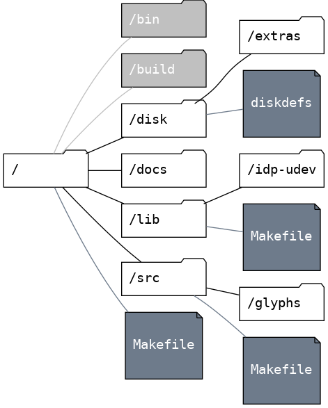

# Anatomy of an Iskra Delta Partner Game, Part 1: A Guide to Structuring Directories and Writing a Makefile

[oddbit-retro, 15.7.2023](https://oddbit-retro.org)

Creating a computer game for an outdated and poorly documented platform can be challenging. In this article, I aim to help you begin your journey in *Iskra Delta Partner* programming by offering a template directory structure, a Makefile, and explanations of their functions.

## Prerequisites
To compile the project, it is necessary to have a *Linux operating system* with the *apt package manager* present. Please ensure that your Linux system has the apt package manager available. You can then proceed with the following steps to ensure successful compilation of the project.

`sudo apt install sdcc make sed cpmtools`

 > The top Makefile tests for presence of these tools.

 ## Directory Structure
In a typical Unix C development project, you would usually find the following folders:

 - **/bin** This directory is intended for storing the final executable files.
 - **/lib** This directory is designated for external libraries, with each library having its own sub-directory.
 - **/include** This directory is dedicated to storing the include files that will be  used by consumers of your project, particularly if your project  functions as a library.
 - **/src** This directory is used for storing the source code of your project.
 - **/doc** This directory is where you can keep all the documentation for your project.

We will use this as a starting point for the Iskra Delta Partner C development project and include the following directories.

Extra directories for our project include:

 - **/build** This directory is used for compilation. To avoid naming conflicts, it is recommended to compile each library into its own directory.
 - **/disk** In addition to executables, our compilation process also generates floppy disk images that can be loaded directly into the emulator. This directory contains files related to floppy disk images. For example, if you're working with Iskra Delta Partners without a hard drive, you'll need system files on your floppy. You can place an empty boot image floppy here and add your binaries during the compilation.
 - **/disk/diskdefs** This file is used by cpmtools to ensure the correct disk format.
 - **/disk/extras** If you need to include additional files like manuals or configurations on the disk, you can place them in this folder. The compilation process will automatically copy them to the disk image. Just be cautious not to exceed the total disk size.
 - **/src/glyphs** This directory is recommended for storing your graphics as source code.
 - **Makefile** Each compilable directory has its own Makefile. The Makefiles are organized hierarchically, so the top file in the root directory calls the Makefiles in subdirectories.

 ## Git Submodules

In addition to the compilation tools, you'll also need the Iskra Delta Partner SDK. We suggest including it in your Git project as a git submodule.

There are two SDK projects available on GitHub. In this guide, we'll use the [idp-udev](https://github.com/tstih/idp-udev), which is a lightweight version of the SDK and only includes a subset of the Standard C library. The full version is called [idp-dev](https://github.com/tstih/idp-dev). The process of compiling and using it is similar to what we'll describe here.

To add the submodule to your project, go to the `/lib` directory and enter the following command:

~~~
git submodule add https://github.com/tstih/idp-udev.git
~~~

Afterwards, whenever you clone your Git repository, make sure to include the `--recurse` flag, like this: `git clone <your repo> --recurse`.

 > The submodule will function like any other directory in your project but will be linked to its own Git repository.

 

 # UNDER CONSTUCTION!!!

The Makefile(s)

Now let's take a look at the core of our compilation system: the Makefiles. We'll begin with the top-level Makefile and explain how to write Makefiles in subdirectories.
The Top-Level Makefile

The top-level Makefile begins by checking the operating system and ensuring that all necessary tools are available. If any of the required tools are missing, the compilation process will fail.

 Let's now provide a detailed explanation of the code above. The CC represents our compiler, and the CFLAGS are the arguments that we pass to it. We instruct the compiler to:

    Use the C11 standard (--std-c11).
    Generate code for the z80 architecture (-mz80).
    Generate additional files for debugging purposes (--debug).
    Avoid searching for header files or automatically including standard headers (--nostdinc).
    Search for header files only in the specific directories we provide ($(addprefix -I,$(INC_DIR))).

The AS represents our assembler, and we use it with the following arguments:

    Ensure that symbols are globally accessible (g).
    Generate a hexadecimal listing of the code (x).
    Create a list file (l).
    Create an object file (o).
    Create a symbol file (s).

To accommodate a specific feature of SDCC, we need to link our object files and libraries twice. The first linking process involves using SDCC, which generates a link script with the extension .LK for us. This script correctly places our code segment at address 0x100, which is the appropriate starting address for a CP/M program. However, it mistakenly assigns the data segment to address 0x8000, which is incorrect. We want our data segment to immediately follow the code segment. To rectify this, we employ a tool called sed to remove the data segment address specification from the linker script.

When linking with SDCC, we utilize some arguments that are shared with the compiler. Here are the specific arguments for the linker:

    Place our code at address 0x100 (--code-loc 0x100).
    Exclude the standard start-up code (--no-std-crt0).
    Omit the standard C libraries (--nostdlib).
    Generate a .CDB file for debugging (-Wl -y).